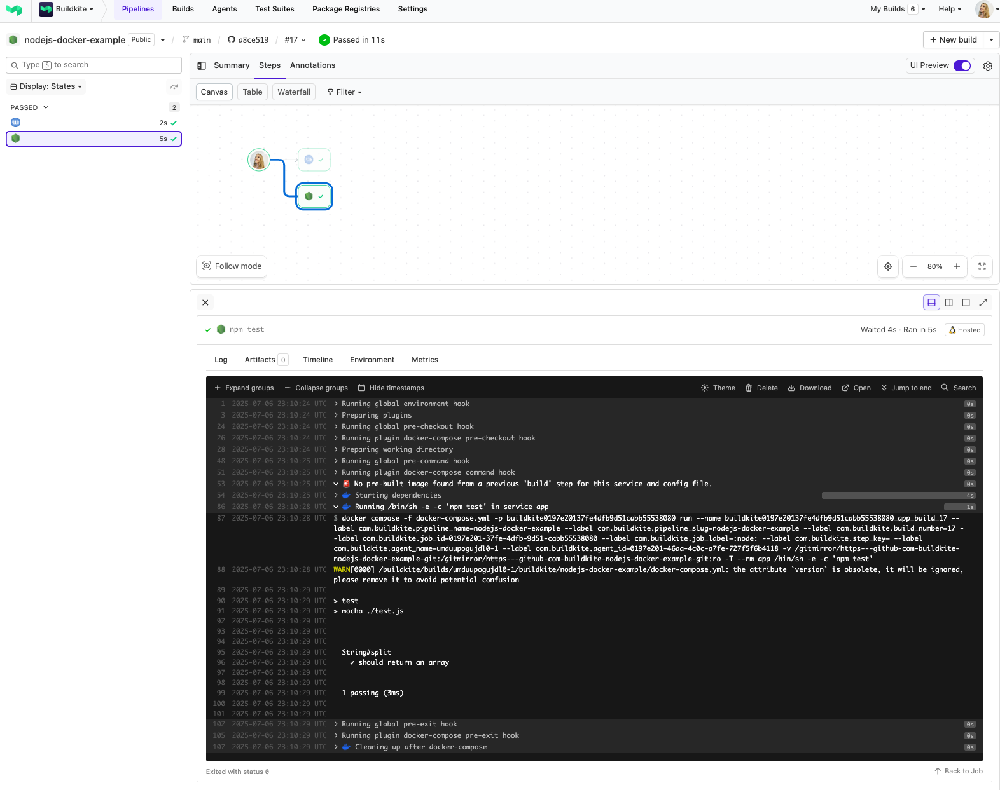

# Buildkite Node.js Docker Example

[](https://buildkite.com/buildkite/nodejs-docker-example)
[](https://buildkite.com/new)

This repository is an example [Buildkite](https://buildkite.com/) pipeline that tests a [Node.js](https://nodejs.org/) project using [Docker](https://docker.com/) and the standard [Node.js Docker image](https://hub.docker.com/_/node/).

👉 **See this example in action:** [buildkite/nodejs-docker-example](https://buildkite.com/buildkite/nodejs-docker-example/builds/latest?branch=main)

[](https://buildkite.com/new)

<a href="https://buildkite.com/buildkite/nodejs-docker-example/builds/latest?branch=main">
  
</a>

<!-- docs:start -->

## How it works

This example:
- Uses Docker Compose to run `npm test` inside a container
- Uses the official `node` Docker image
- Tests a simple Node.js app in a containerized Buildkite pipeline

<!-- docs:end -->

## Running locally

To run the test outside of Buildkite:

```bash
docker-compose run app npm test
```

## License

See [LICENSE.md](LICENSE.md) (MIT)
